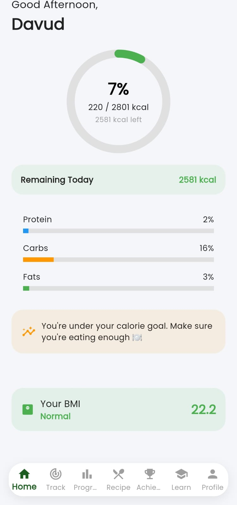
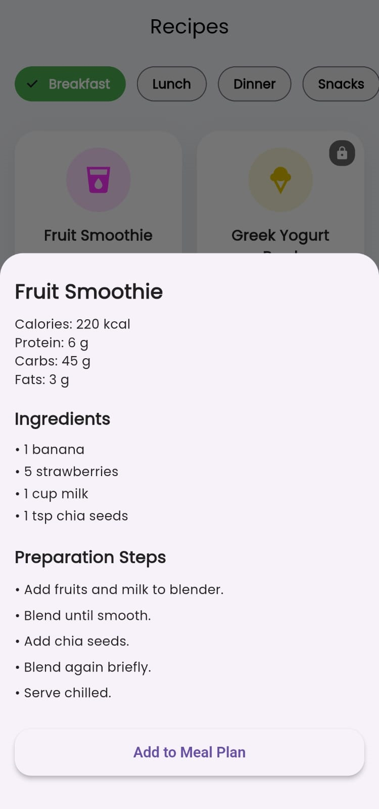
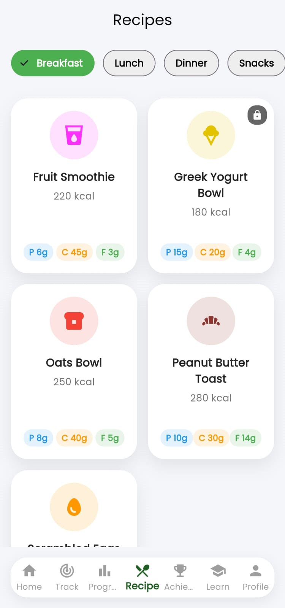
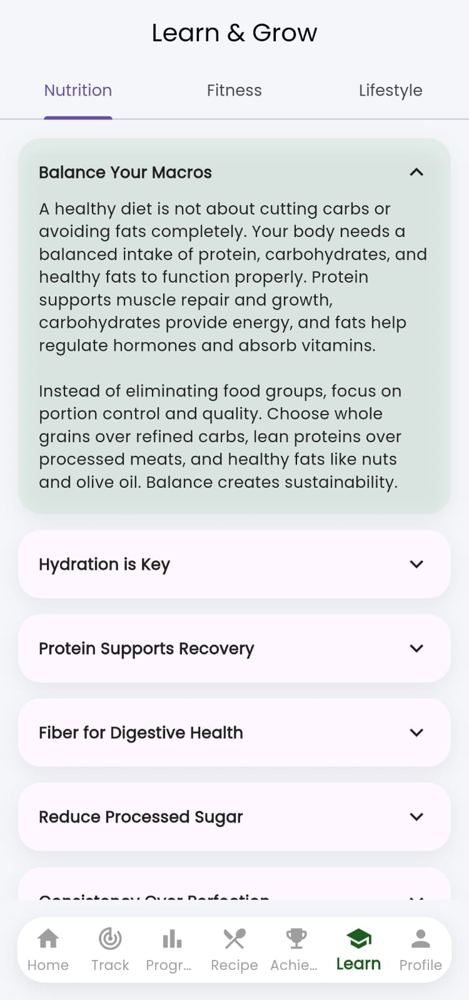
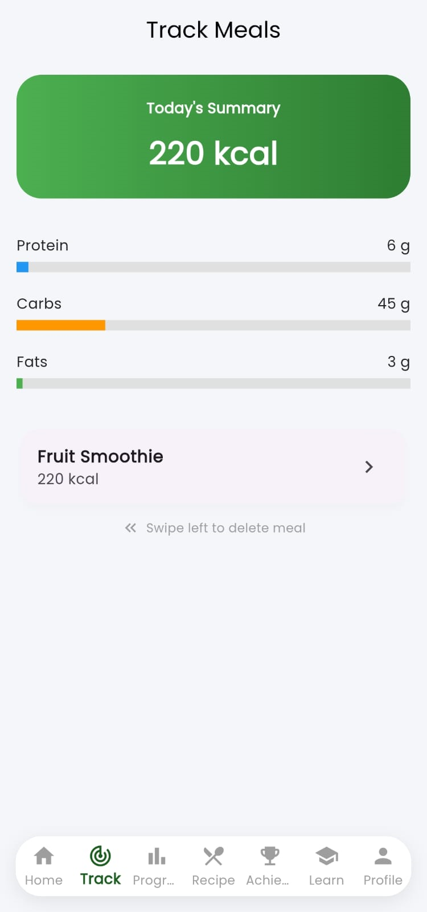
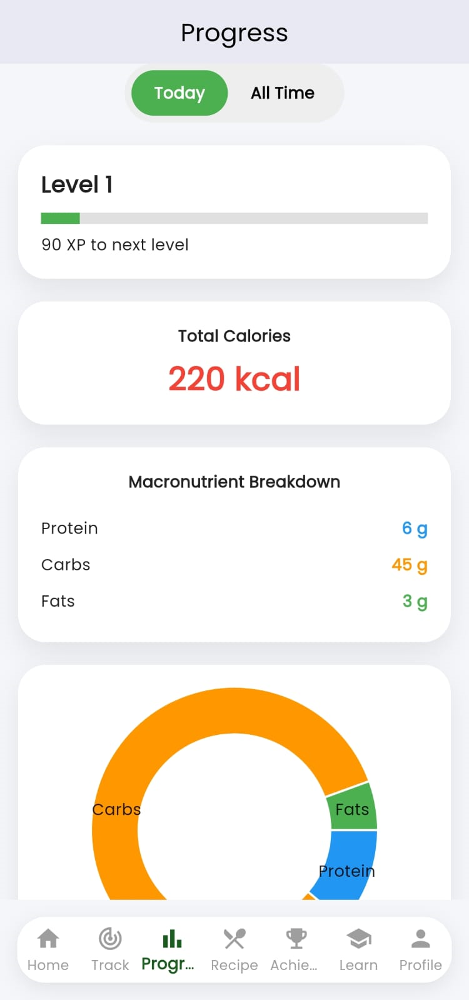
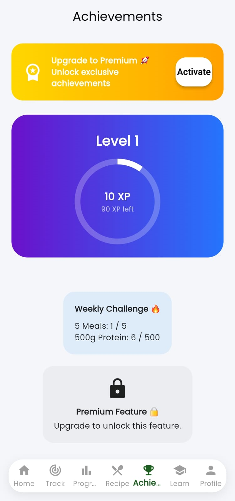
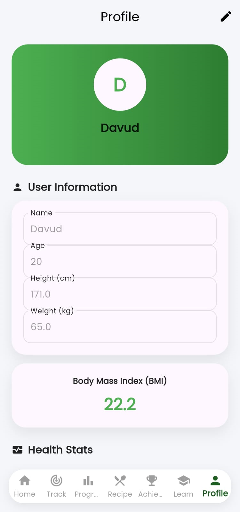

# NutriGuide 🥗

An AI-powered nutrition guide application that helps users make healthier food choices and track nutritional information.

## Features

- Personalized nutrition recommendations
- AI-powered food guidance
- Meal planning assistance
- Health-focused insights
- Smart nutrition suggestions

## Tech Stack

- Flutter
- Dart
- AI Integration

## Installation

```bash
git clone https://github.com/Lucky-Naik/NutriGuide.git
cd NutriGuide
flutter pub get
flutter run
```

## Future Enhancements

- Food image recognition
- Calorie tracking
- Personalized diet plans
- Health analytics dashboard

## 📸 App Screenshots

### 🏠 Home Page


### 🔐 Login Page


### 📝 Sign Up Page


### 🥗 Ingredients Page


### 🍽️ Recipe Page


### 📚 Learn Page


### 📈 Track Page


### 📊 Progress Page


### 🏆 Achievement Page


### 👤 Profile Page


## Author

Lucky Naik